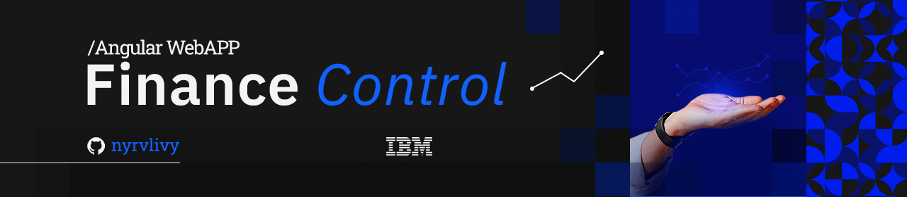
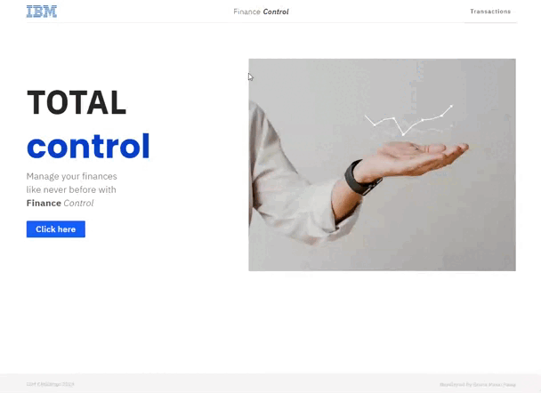
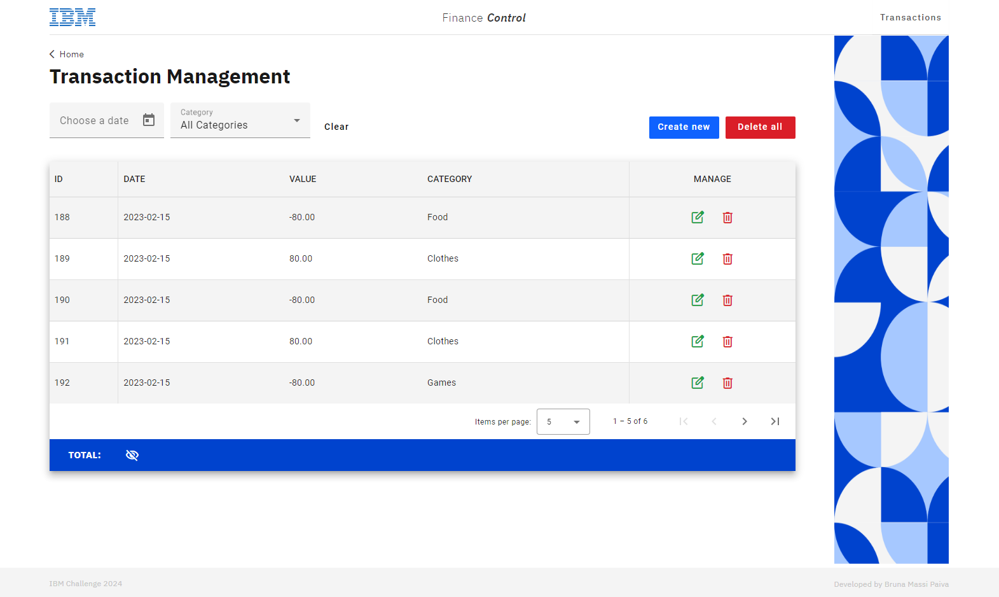
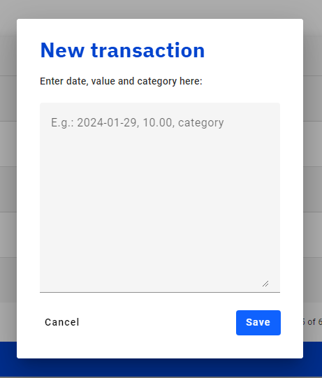
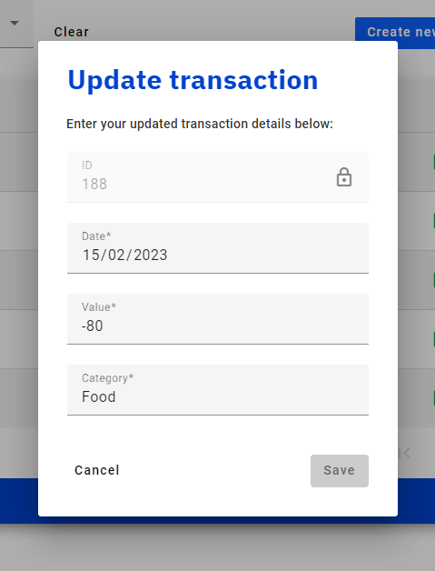
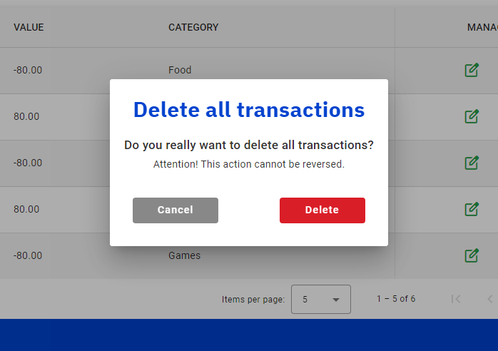
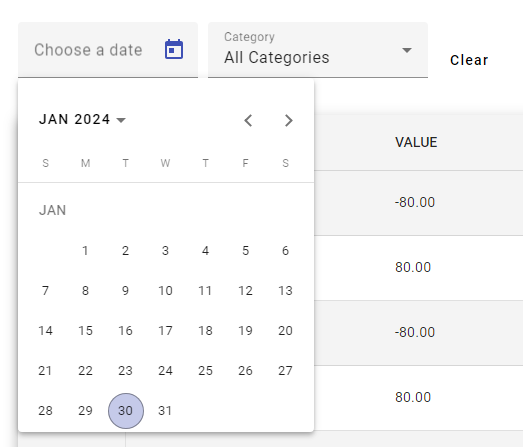
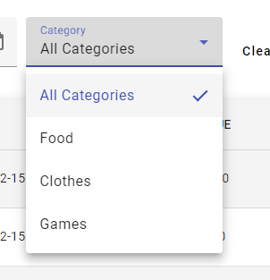

<div align="center">
  
</div>

<h1 align="center">Finance Control Web Application</h1>
<p align="center">Frontend Development Project: Building an Angular Web Application for Financial Transaction Management.</p>

<div align="center">


</div>

##

## Table of contents

* [Project Description](#project-description)
* [Overview](#overview)
* [How to Setup?](#how-to-setup)
* [Features](#features)
    <details>
    <summary>Click to expand</summary>

  - [Find All Transactions](#find-all-transactions)
  - [Create Transaction](#create-transaction)
  - [Update Transaction](#update-transaction)
  - [Delete Transaction](#delete-transaction)
  - [Filter by Date](#filter-by-date)
  - [Filter by Category](#filter-by-category)

  </details>
* [Structure](#structure)
* [Contributing](#contributing)
* [License](#license)

##

## Project Description

This project is an **Angular Web Application** developed to interact with the Finance Control API, providing a user-friendly interface for managing financial transactions, financial transaction management, featuring batch and individual transaction handling, CRUD operations, and date-based data filtering.

##

## Overview

See a sample of how the application works:
<div align="center">
  
  <br>
  For more information, clone repository and fun!
</div>

##

## How to Setup?

- [x] Fork this repository to your GitHub;
- [ ] Clone your repository to your machine;

```bash
    git clone https://github.com/nyrvlivy/finance-control
```

#### Set up your development environment:

#### Set up your development environment:

- [ ] Make sure you have [Node.js](https://nodejs.org/) and [Angular CLI](https://angular.io/cli) installed on your machine.
- [ ] Open the terminal of your preferred IDE. Navigate to the project's root directory and install the dependencies with `npm install`.

```bash
    cd finance-control
    npm install
```

- [ ] Start the development server with ng serve.

```bash
    ng serve
```

- [ ] Open your browser and navigate to http://localhost:4200/ to view the application.
- [ ] And enjoy it! 🎊👏

##

## Features

Below are listed some features that the project includes:

- Dashboard displaying recent transactions and summary.
- CRUD operations for managing transactions.
- Filtering and sorting transactions by date, category, and value.
- Creation of transactions individually or in batches.
- Control to delete one or all transactions at once.
- Sum of input and output values filtered by date and category.

If you want to know more about:
<details>
    <summary>Click to expand</summary>

### Find All Transactions

The Find-All-Transactions feature includes a table that lists items by ID, Date, Value, and Category,
the control to manage every item by deleting them all or editing individually, a paginator below the list
and the total sum of values.

<div align="center">
  
</div>

### Create Transaction

The user can create one or multiple transactions at once in the New Transaction dialog by inputting them following
the format: yyyy/mm/dd, value, category.
To do a mass creation, they just have to enter one transaction per row.

<div align="center">
  
</div>

### Update Transaction

In the Update Transaction tab, the user can edit their transaction's properties including: date, value, and category.
The ID is also shown but is not changeable.

<div align="center">
  
</div>

### Delete Transaction

The Delete Transaction popup appears when a user clicks on the Delete All button or the trash icon displayed
on the right side of every transaction item.
In the tab, the user should decide between canceling or proceeding and delete the transaction(s).

<div align="center">
  
</div>

### Filter by Date

This calendar pops up when the user clicks on the Date Filter and should be able to filter the transactions
by a specified date.

<div align="center">
  
</div>

### Filter by Category

The Category Filter lists every category created in the transactions, by just clicking on and selecting
the category name listed.

<div align="center">
  
</div>

  </details>

##

## Structure

The application is structured into modules, components, services, and shared resources:

- **Modules:** Encapsulate specific functionalities like transaction management and user authentication.
- **Components:** Reusable UI elements crafted with Angular Material.
- **Services:** Handle business logic and API integration.
- **Shared Resources:** Include common utilities, models, and interfaces.

##

## Contributing

Feel free to fork this project and contribute your ideas and improvements. Please adhere to the [Angular Style Guide](https://angular.io/guide/styleguide) for code consistency.

##

## License

This project is licensed under the MIT License. See the [LICENSE](https://github.com/Nyrvlivy/FinanceControl/blob/main/LICENSE) file for details.

##

<div align="center">

### ⚠️ ATTENTION ⚠️

**Important Note:** _Kindly be aware that this serves as my personal record for extracurricular activities. It comprises numerous date and time entries, facilitating a thorough analysis of my growth and proficiency throughout my learning journey and exercise execution._

**If your intention is to embark on an Angular learning journey from the very beginning, I recommend seeking more pedagogically structured explanations elsewhere.**

</div>

##

<div align="center">

**Start your Angular learning journey right now! Happy coding! 💻**

</div>

##

###### tags: `Angular` `Frontend` `Web Development` `SCSS` `Angular Material`

<div align="center">
  
</div>


